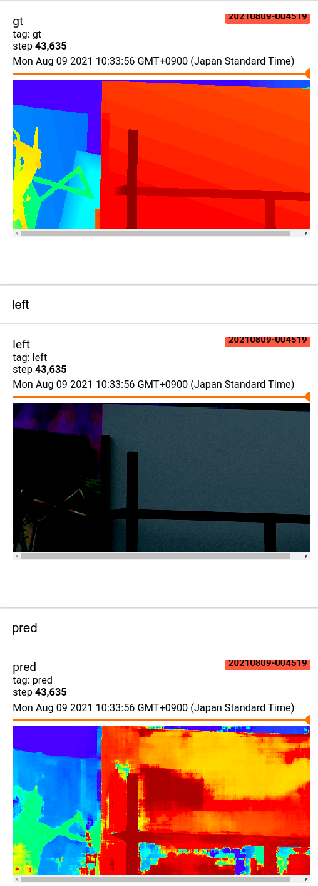

# GC Net Tensorflow2

### Intro

This is a **Work In Progress** Tensorflow implementation of ["End-to-End Learning of Geometry and Context for Deep Stereo Regression"](https://arxiv.org/abs/1703.04309)

Below picture shows the training samples after ***2 epochs*** in Tensorboard over Sceneflow dataset. It's huge dataset and my potato laptop can't handle more epochs.  
<!--361*698-->

<p align="center">
    
    
</p>

### Installation
Normally here I'd give instruction to install but Tensorflow installation is complicated. So I can only tell you that this work is done in tensorflow 2.2.2, Ubuntu 20.04, CUDA 10.1, CUDNN 7.6.5

See https://www.tensorflow.org/install/source#gpu for more info about Tensorflow version related to CUDA+CUDNN

### Training
```
python train.py --cfg config/potato_laptop.yaml
```

### Inference
TODO:

### Status:
What's working?
- Full GC Net network
    - Cost Volume -> Provide better information of disparity
    - Soft Argmin / Soft Argmax -> Provide subpixel disparity
- Customizable Config through YAML
- Preprocessing
    - Random Crop based on the network training height and width -> Can handle more epochs without overfitting (but my potato laptop can't handle it)
- Tensorboard images and loss logging
- Checkpoint save file
